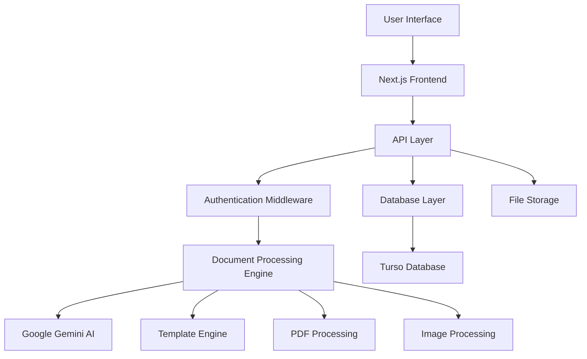

<div align="center">


# 🚀 DocMate

**AI-Powered Document Processing & Analysis Platform**

[](https://nextjs.org/)
[](https://www.typescriptlang.org/)
[](https://tailwindcss.com/)
[](https://vercel.com/)

*Winner of WinHacks 2025 🏆 - First Place out of 30 competing teams*

[🌐 Live Demo](https://docmate.vercel.app) • [📖 Documentation](https://docmate.vercel.app/docs) • [🎮 Playground](https://docmate.vercel.app/playground) • [🛠️ API Reference](https://docmate.vercel.app/docs/api)

</div>

---

## 🎯 Overview

**DocMate** is an intelligent document processing platform that uses AI to automatically extract, analyze, and structure data from any document type. Born from a winning hackathon project at WinHacks 2025, DocMate transforms tedious manual document processing into seamless automation.

### 🎪 The Problem We Solve

- **Manual Data Entry**: Eliminate hours of tedious document processing
- **Human Error**: Reduce mistakes in data extraction and transcription
- **Scalability Issues**: Handle thousands of documents without growing your team
- **Format Inconsistency**: Process diverse document types with unified templates
- **Integration Challenges**: Seamlessly connect with existing workflows via API

### 🎭 Our Solution

DocMate leverages Google's Gemini AI to intelligently understand document structure and content, extracting exactly what you need through customizable templates and delivering results in multiple formats (JSON, CSV, Markdown).

---

## ✨ Key Features

### 🧠 **AI-Powered Document Processing**
- **Google Gemini Integration**: State-of-the-art AI for document understanding
- **OCR Technology**: Extract text from images, PDFs, and scanned documents
- **Multi-format Support**: Process PDFs, images (JPG, PNG), and more
- **Intelligent Analysis**: Get summaries, insights, and sentiment analysis

### 🎨 **Custom Template System**
- **Visual Template Editor**: Create extraction templates without coding
- **Pre-built Templates**: Ready-to-use templates for common document types
- **Field Validation**: Ensure data quality with type checking
- **Dynamic Schemas**: Adapt templates for varying document structures

### 🔄 **Flexible Output Formats**
- **JSON**: Structured data for API integration
- **CSV**: Spreadsheet-compatible format for analysis
- **Markdown**: Human-readable documentation format
- **Formatted Views**: Beautiful web interface for quick review

### 🌐 **RESTful API**
- **Endpoint Management**: Create custom API endpoints for your templates
- **Authentication**: Secure API access with JWT tokens
- **Rate Limiting**: Built-in protection against abuse
- **Webhook Support**: Real-time notifications for processed documents

### 📊 **Analytics & Insights**
- **Processing History**: Track all document processing activities
- **Usage Analytics**: Monitor API endpoint performance
- **Confidence Scores**: Understand AI extraction reliability
- **Export Capabilities**: Download processed data in multiple formats

### 🎮 **Interactive Playground**
- **Live Document Processing**: Test templates in real-time
- **PDF Viewer**: Built-in viewer with text selection and analysis
- **History Management**: Review and revisit previous analyses
- **Template Testing**: Validate templates before production use

---

## 🏗️ Architecture

DocMate is built with modern web technologies and follows best practices for scalability and maintainability.

### 🛠️ **Tech Stack**

#### **Frontend**
- **Next.js 15**: React framework with App Router
- **TypeScript**: Type-safe development
- **Tailwind CSS**: Utility-first styling
- **Framer Motion**: Smooth animations and transitions
- **React PDF**: PDF viewing and processing
- **Radix UI**: Accessible component primitives

#### **Backend**
- **Next.js API Routes**: Serverless backend functions
- **Node.js**: Runtime environment
- **JWT**: Secure authentication
- **Zod**: Runtime type validation
- **bcrypt**: Password hashing

#### **AI & Processing**
- **Google Gemini AI**: Document analysis and extraction
- **AI SDK**: Streamlined AI integration
- **PDF-lib**: PDF manipulation
- **Sharp**: Image processing

#### **Database**
- **Turso (LibSQL)**: Distributed SQLite database
- **SQL Schema**: Relational data modeling
- **Migrations**: Version-controlled database changes

#### **UI/UX**
- **Responsive Design**: Mobile-first approach
- **Dark/Light Mode**: User preference support
- **Accessibility**: WCAG compliant components
- **Progressive Web App**: Offline capabilities

### 🏛️ **System Architecture**



---

## 🎨 UI Components

DocMate features a comprehensive component library built with Radix UI and Tailwind CSS:

### 🧩 **Core Components**

- **Button**: Multiple variants and sizes
- **Card**: Content containers with hover effects
- **Dialog**: Modal windows and popups
- **Input**: Form inputs with validation
- **Select**: Dropdown selectors
- **Tabs**: Content organization
- **Toast**: Notification system
- **Progress**: Loading indicators
- **Skeleton**: Loading placeholders

### 📱 **Document Components**

- **DocumentProcessor**: Main processing interface
- **DocumentViewer**: PDF display with controls
- **DocumentToolbar**: Action buttons and tools
- **TemplateEditor**: Visual template creation
- **ResultsDisplay**: Multi-format result viewer

### 🎪 **Specialized Components**

- **PDFViewer**: React-PDF integration
- **AuthDialog**: Login/signup modals
- **SettingsDialog**: User preferences
- **HistorySection**: Processing history
- **APIPlayground**: Interactive API testing

---

## 📄 License

This project is licensed under the MIT License - see the [LICENSE](LICENSE) file for details.

```
MIT License

Copyright (c) 2024 DocMate Team

Permission is hereby granted, free of charge, to any person obtaining a copy
of this software and associated documentation files (the "Software"), to deal
in the Software without restriction, including without limitation the rights
to use, copy, modify, merge, publish, distribute, sublicense, and/or sell
copies of the Software, and to permit persons to whom the Software is
furnished to do so, subject to the following conditions:

The above copyright notice and this permission notice shall be included in all
copies or substantial portions of the Software.

THE SOFTWARE IS PROVIDED "AS IS", WITHOUT WARRANTY OF ANY KIND, EXPRESS OR
IMPLIED, INCLUDING BUT NOT LIMITED TO THE WARRANTIES OF MERCHANTABILITY,
FITNESS FOR A PARTICULAR PURPOSE AND NONINFRINGEMENT. IN NO EVENT SHALL THE
AUTHORS OR COPYRIGHT HOLDERS BE LIABLE FOR ANY CLAIM, DAMAGES OR OTHER
LIABILITY, WHETHER IN AN ACTION OF CONTRACT, TORT OR OTHERWISE, ARISING FROM,
OUT OF OR IN CONNECTION WITH THE SOFTWARE OR THE USE OR OTHER DEALINGS IN THE
SOFTWARE.
```

---

## 🙏 Acknowledgments

### 🏆 **Awards & Recognition**
- **WinHacks 2025**: 🥇 First Place Winner (out of 30 teams)
- **Innovation Award**: Best use of AI technology
- **People's Choice**: Most practical solution

### 👨‍💻 **Development Team**
- **[Ibrahim Arain](https://github.com/ibrahim-arain)**: Lead Developer & Project Manager
- **[Ahmad Arain](https://github.com/ahmad-arain)**: Full-Stack Developer & UI/UX Designer  
- **[Mohammad Affan Shahid](https://github.com/affan-shahid)**: Backend Developer & Database Architect
- **[Sahaj Kataria](https://github.com/sahaj-kataria)**: Frontend Developer & AI Integration Specialist

### 🛠️ **Technologies & Libraries**
- **[Next.js](https://nextjs.org/)**: React framework
- **[Google AI](https://ai.google.dev/)**: Gemini AI models
- **[Turso](https://turso.tech/)**: Database platform
- **[Vercel](https://vercel.com/)**: Deployment platform
- **[Tailwind CSS](https://tailwindcss.com/)**: Styling framework
- **[Radix UI](https://www.radix-ui.com/)**: Component primitives
- **[Framer Motion](https://www.framer.com/motion/)**: Animation library

### 🎉 **Special Thanks**
- **WinHacks 2025 Organizers**: For providing the platform to innovate
- **Mentors & Judges**: For valuable feedback and guidance
- **Open Source Community**: For the amazing tools and libraries
- **Beta Testers**: For helping us improve the platform

---

<div align="center">

### 🚀 Ready to Transform Your Document Processing?

**[Get Started Now](https://docmate.vercel.app)** • **[View Demo](https://docmate.vercel.app/demo)** • **[API Docs](https://docmate.vercel.app/docs/api)**

---

**Built with ❤️ by the DocMate Team**

*Turning paperwork chaos into structured data magic* ✨


</div>
