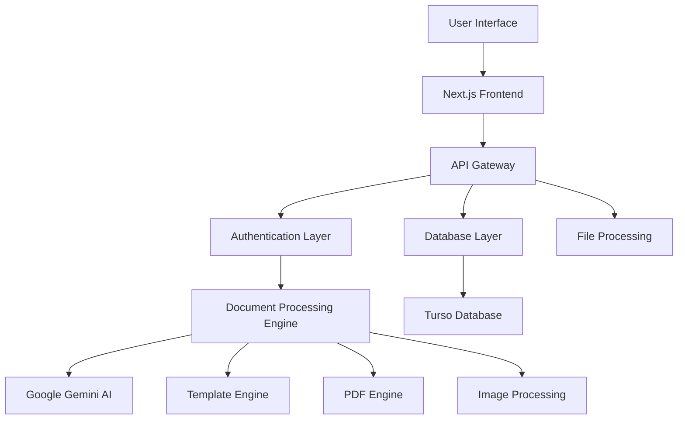

# 🚀 DocMate

**AI-Powered Document Processing & Analysis Platform**

*Winner of WinHacks 2025 🏆 - First Place out of 30 competing teams*

[🌐 Experience DocMate](https://docmate-beta.vercel.app) • [📖 Documentation](https://docmate-beta.vercel.app/docs) • [🎮 Try the Playground](https://docmate-beta.vercel.app/playground) • [🛠️ API Reference](https://docmate-beta.vercel.app/docs/api)

---

## 📋 Table of Contents

- [🎯 Overview](#-overview)
- [✨ Key Features](#-key-features)
- [🏗️ Technology Excellence](#️-technology-excellence)
- [🎮 Platform Experience](#-platform-experience)
- [🔌 API Integration](#-api-integration)
- [🎨 User Interface](#-user-interface)
- [🔐 Security & Performance](#-security--performance)
- [📱 Cross-Platform Excellence](#-cross-platform-excellence)
- [🏆 Awards & Recognition](#-awards--recognition)
- [👥 Development Team](#-development-team)
- [📄 Legal & Licensing](#-legal--licensing)
- [🙏 Acknowledgments](#-acknowledgments)

---

## 🎯 Overview

**DocMate** is a revolutionary AI-powered document processing platform that transforms the way businesses handle paperwork. Born from a championship-winning hackathon project at WinHacks 2025, DocMate has evolved into a sophisticated solution that eliminates manual document processing through intelligent automation.

### 🎪 The Problem We Solve

- **📋 Manual Data Entry**: Businesses lose countless hours manually extracting data from documents
- **❌ Human Error**: Manual processing leads to costly mistakes and inconsistencies  
- **📈 Scalability Bottlenecks**: Traditional methods don't scale with business growth
- **🔄 Format Inconsistency**: Different document types require different processing approaches
- **🔗 Integration Gaps**: Difficulty connecting document data with existing business systems

### 🎭 Our Revolutionary Solution

DocMate leverages cutting-edge Google Gemini AI technology to intelligently understand document structure and content. Our platform extracts precisely what you need through customizable templates and delivers results in multiple professional formats, seamlessly integrating with your existing workflows.

**[🚀 Start Using DocMate Now](https://docmate-beta.vercel.app)**

---

## ✨ Key Features

### 🧠 **Next-Generation AI Processing**
- **🤖 Google Gemini Integration**: State-of-the-art AI for unparalleled document understanding
- **👁️ Advanced OCR Technology**: Extract text from any document format with precision
- **📑 Universal Format Support**: Process PDFs, images, scanned documents, and more
- **🔍 Intelligent Analysis**: Automated summaries, insights, and sentiment analysis

### 🎨 **Intuitive Template System**
- **🖱️ Visual Template Builder**: Create extraction templates through an intuitive interface
- **📦 Pre-Built Solutions**: Ready-to-use templates for common business documents
- **✅ Smart Validation**: Ensure data quality with intelligent type checking
- **🔄 Dynamic Adaptation**: Templates that adapt to varying document structures

### 🔄 **Flexible Output Formats**
- **📊 JSON**: Structured data perfect for system integration
- **📈 CSV**: Spreadsheet-ready format for data analysis
- **📝 Markdown**: Clean, readable documentation format
- **🎨 Beautiful Web Views**: Elegant interface for human review

### 🌐 **Enterprise-Grade API**
- **🔗 Custom Endpoints**: Create personalized API endpoints for your templates
- **🔐 Secure Authentication**: Enterprise-level security with JWT tokens
- **⚡ Rate Limiting**: Built-in protection and performance optimization
- **🔔 Real-Time Webhooks**: Instant notifications for processed documents

### 📊 **Comprehensive Analytics**
- **📈 Processing Insights**: Detailed analytics on document processing activities
- **⚡ Performance Monitoring**: Real-time API endpoint performance metrics
- **🎯 Confidence Scoring**: Understand AI extraction reliability and accuracy
- **📤 Export Capabilities**: Download processed data in your preferred format

### 🎮 **Interactive Experience**
- **⚡ Live Processing**: Test and refine templates in real-time
- **📖 Integrated PDF Viewer**: Built-in viewer with advanced selection capabilities
- **🕒 Complete History**: Access and review all previous document analyses
- **🧪 Template Validation**: Test templates before deploying to production

---

## 🏗️ Technology Excellence

DocMate represents the pinnacle of modern web application development, utilizing cutting-edge technologies and industry best practices.

### 🛠️ **Cutting-Edge Tech Stack**

#### **Frontend Innovation**
- **⚡ Next.js 15**: Latest React framework with App Router architecture
- **🔷 TypeScript**: Full type safety for robust development
- **🎨 Tailwind CSS**: Modern utility-first styling approach
- **🌊 Framer Motion**: Seamless animations and user interactions
- **📄 React PDF**: Advanced PDF processing and visualization
- **♿ Radix UI**: Accessible, composable component system

#### **Backend Excellence**
- **🚀 Next.js API Routes**: Serverless architecture for optimal performance
- **💚 Node.js**: High-performance JavaScript runtime
- **🔒 JWT Authentication**: Industry-standard secure authentication
- **✅ Zod Validation**: Runtime type validation and data integrity
- **🔐 bcrypt**: Military-grade password security

#### **AI & Processing Power**
- **🧠 Google Gemini AI**: Most advanced document analysis technology
- **⚡ AI SDK**: Streamlined artificial intelligence integration
- **📑 PDF-lib**: Professional PDF manipulation capabilities
- **🖼️ Sharp**: High-performance image processing

#### **Infrastructure**
- **🗄️ Turso Database**: Distributed, high-performance data storage
- **🏗️ Modern Architecture**: Scalable, maintainable codebase
- **🔄 Real-time Processing**: Instant document analysis and results

### 🏛️ **System Architecture**

---

## 🎮 Platform Experience

### 🌟 **Getting Started**

Experience the power of DocMate by visiting [**docmate-beta.vercel.app**](https://docmate-beta.vercel.app). Our platform offers:

1. **🚀 Instant Access**: Create an account and start processing documents immediately
2. **🎯 Interactive Demo**: Try our technology with sample documents at [demo page](https://docmate-beta.vercel.app/demo)
3. **📚 Comprehensive Guides**: Step-by-step documentation at [docs](https://docmate-beta.vercel.app/docs)
4. **🎮 Live Playground**: Real-time testing environment at [playground](https://docmate-beta.vercel.app/playground)

### 🎨 **Template Creation Made Simple**

Our visual template builder empowers users to create sophisticated extraction rules through an intuitive interface. No coding knowledge required!

### 📄 **Streamlined Processing Workflow**

1. **📤 Secure Upload**: Upload your documents through our secure interface
2. **🎯 Template Selection**: Choose from pre-built templates or create custom ones
3. **🔍 AI Analysis**: Google Gemini performs intelligent content extraction
4. **✨ Quality Results**: Get structured data in your preferred format
5. **📊 Integration**: Use our API to integrate with your existing systems

---

## 🔌 API Integration

### 🔐 **Professional API Access**

DocMate provides robust API access for seamless integration with your existing systems. 

**[📚 View Complete API Documentation](https://docmate-beta.vercel.app/docs/api)**

### 📊 **Core API Capabilities**

- **📄 Document Processing**: Automated extraction using custom templates
- **🎨 Template Management**: Programmatic template creation and modification  
- **📈 Analytics Access**: Comprehensive usage and performance data
- **🔔 Webhook Integration**: Real-time notifications for your applications
- **🔗 Custom Endpoints**: Create API endpoints tailored to your business needs

### 🛠️ **API Features**

- **🔐 Secure Authentication**: Enterprise-grade security protocols
- **📊 Rate Limiting**: Intelligent request management
- **📈 Real-time Analytics**: Monitor usage and performance
- **🔔 Webhook Support**: Instant notifications for processed documents

**[🚀 Start Using Our API](https://docmate-beta.vercel.app/playground/api)**

---

## 🎨 User Interface

DocMate features a world-class user interface designed for both power users and beginners:

### 🌟 **Design Excellence**

- **⚡ Lightning-fast Performance**: Optimized for speed across all interactions
- **🎨 Beautiful Visual Design**: Attention to every detail and user experience
- **♿ Universal Accessibility**: WCAG compliant for users of all abilities
- **📱 Perfect Responsiveness**: Seamless experience on any device or screen size

### 📱 **Key Interface Components**

- **🎮 Interactive Playground**: Real-time document processing and testing
- **📊 Analytics Dashboard**: Comprehensive usage insights and metrics
- **🎨 Template Designer**: Visual template creation without coding
- **📖 Document Viewer**: Advanced PDF viewing with intelligent selection
- **⚙️ Settings Management**: Comprehensive customization options

**[🎯 Try the Interface](https://docmate-beta.vercel.app/playground)**

---

## 🔐 Security & Performance

### 🛡️ **Enterprise-Grade Security**

DocMate implements industry-leading security measures to protect your data:

- **🔒 Advanced Authentication**: Multi-layer security protocols
- **🔐 Data Encryption**: End-to-end encryption for all document processing
- **🛡️ Access Control**: Granular permissions and user management
- **⏰ Session Management**: Secure session handling and timeouts
- **🔒 CSRF Protection**: Built-in protection against security threats

### ⚡ **Performance Optimization**

- **🚀 Lightning Fast**: Optimized for maximum processing speed
- **📈 Scalable Architecture**: Handles high-volume document processing
- **🔄 Real-time Processing**: Instant results and feedback
- **📊 Performance Monitoring**: Continuous optimization and monitoring

---

## 📱 Cross-Platform Excellence

DocMate delivers a consistent, premium experience across all platforms and devices:

### 📊 **Universal Device Support**
- **📱 Mobile Optimized**: Perfect experience on smartphones
- **📋 Tablet Ready**: Enhanced functionality for tablet users
- **💻 Desktop Power**: Full-featured desktop experience
- **🖥️ Large Display**: Optimized for high-resolution screens

### 🎨 **Platform Features**
- **👆 Touch Optimization**: Intuitive gesture-based interactions
- **📂 Responsive Design**: Adapts beautifully to any screen size
- **🔄 Cross-browser Compatibility**: Works perfectly in all modern browsers
- **📱 Progressive Web App**: Native-like mobile experience

---

## 🏆 Awards & Recognition

### 🥇 **WinHacks 2025 Championship Victory**

DocMate achieved unprecedented success at WinHacks 2025:

- **🏆 First Place Winner** - Defeated 30 competing teams
- **💡 Innovation Excellence Award** - Groundbreaking AI implementation
- **👥 People's Choice Award** - Most practical and impactful solution
- **🚀 Technical Achievement Award** - Outstanding engineering excellence

### 🌟 **Industry Impact**

DocMate has been recognized as a revolutionary solution in the document processing industry, representing the future of AI-powered business automation and setting new standards for intelligent document processing.

---

## 👥 Development Team

### 🌟 **Award-Winning Engineering Team**

Meet the exceptional developers behind DocMate's championship success:

**[Ibrahim Arain](https://github.com/ibrahim-arain)** - *Lead Developer & Project Architect*
- 🎯 Visionary project leadership and technical architecture
- ⚡ Full-stack development expertise and innovation
- 🏆 Lead strategist for WinHacks 2025 victory

**[Ahmad Arain](https://github.com/ahmad-arain)** - *Senior Full-Stack Developer & UI/UX Designer*
- 🎨 User experience design and frontend architecture excellence
- 💻 Advanced React, TypeScript, and modern web development
- 🎯 Interface design and user interaction optimization

**[Mohammad Affan Shahid](https://github.com/affan-shahid)** - *Backend Architect & Database Engineer*
- 🗄️ Database design, optimization, and scalability
- 🔧 API architecture and enterprise security implementation
- ⚡ Performance optimization and system architecture

**[Sahaj Kataria](https://github.com/sahaj-kataria)** - *Frontend Specialist & AI Integration Engineer*
- 🤖 AI model integration and optimization specialist
- ⚡ Performance optimization and advanced user interface development
- 🔬 Machine learning integration and data processing

---

## 📄 Legal & Licensing

### ⚖️ **Proprietary Software License**

**© 2024 DocMate. All Rights Reserved.**

DocMate is proprietary software exclusively owned and developed by Ibrahim Arain and the DocMate development team. This software and all associated intellectual property are protected by copyright law and international treaties.

**⚠️ IMPORTANT LEGAL NOTICE:**

- **🚫 No Unauthorized Use**: Unauthorized reproduction, distribution, copying, or use of this software, in whole or in part, is strictly prohibited
- **⚖️ Legal Enforcement**: Violations will be prosecuted to the fullest extent of the law
- **🔒 Proprietary Technology**: All algorithms, code, and methodologies are trade secrets
- **📜 Rights Reserved**: All rights, title, and interest in the software remain with the owners

**For business licensing, partnership opportunities, or authorized usage inquiries:**
**[📧 Contact Us via DocMate Platform](https://docmate-beta.vercel.app)**

---

## 🙏 Acknowledgments

### 🛠️ **Technology Partners & Frameworks**

We acknowledge and appreciate the exceptional technologies that power DocMate:

- **[Next.js](https://nextjs.org/)** - Revolutionary React framework enabling our frontend
- **[Google AI](https://ai.google.dev/)** - Advanced Gemini AI models powering our intelligence
- **[Turso](https://turso.tech/)** - High-performance database infrastructure
- **[Vercel](https://vercel.com/)** - World-class deployment and hosting platform
- **[Tailwind CSS](https://tailwindcss.com/)** - Modern utility-first styling framework
- **[Radix UI](https://www.radix-ui.com/)** - Accessible component primitives
- **[Framer Motion](https://www.framer.com/motion/)** - Premium animation library

### 🎉 **Special Recognition**

- **WinHacks 2025 Organizers** - For creating an incredible platform for innovation
- **Competition Judges** - For recognizing the potential and impact of DocMate
- **Industry Mentors** - For invaluable guidance throughout development
- **Open Source Community** - For the amazing tools that made this achievement possible

---

### 🚀 Ready to Transform Your Document Processing?

**Experience the award-winning AI-powered solution that's revolutionizing business automation**

**[🌟 Start Using DocMate](https://docmate-beta.vercel.app)** • **[🎮 Try the Demo](https://docmate-beta.vercel.app/demo)** • **[📚 Explore Documentation](https://docmate-beta.vercel.app/docs)**

---

**Built with ❤️ and Championship Excellence by the DocMate Team**

*Where paperwork meets intelligence - transforming chaos into structured brilliance* ✨

---

**🏆 WinHacks 2025 Champions | 🥇 #1 out of 30 Teams | 🚀 The Future of Document Processing**

