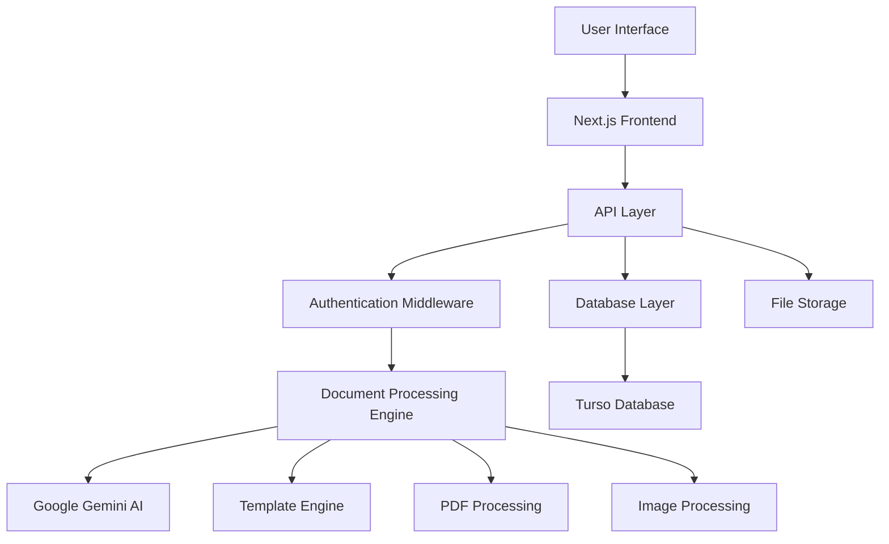

<div align="center">


# 🚀 DocMate

**AI-Powered Document Processing & Analysis Platform**

[](https://nextjs.org/)
[](https://www.typescriptlang.org/)
[](https://tailwindcss.com/)
[](https://vercel.com/)

*Winner of WinHacks 2025 🏆 - First Place out of 30 competing teams*

[🌐 Live Demo](https://docmate.vercel.app) • [📖 Documentation](https://docmate.vercel.app/docs) • [🎮 Playground](https://docmate.vercel.app/playground) • [🛠️ API Reference](https://docmate.vercel.app/docs/api)

</div>

---

## 📋 Table of Contents

- [🎯 Overview](#-overview)
- [✨ Key Features](#-key-features)
- [🏗️ Architecture](#️-architecture)
- [🚀 Quick Start](#-quick-start)
- [⚙️ Installation](#️-installation)
- [🔧 Configuration](#-configuration)
- [📚 Usage Guide](#-usage-guide)
- [🔌 API Reference](#-api-reference)
- [🗄️ Database Schema](#️-database-schema)
- [🎨 UI Components](#-ui-components)
- [🔐 Authentication](#-authentication)
- [📱 Responsive Design](#-responsive-design)
- [🧪 Testing](#-testing)
- [🚢 Deployment](#-deployment)
- [👥 Contributing](#-contributing)
- [📄 License](#-license)
- [🙏 Acknowledgments](#-acknowledgments)

---

## 🎯 Overview

**DocMate** is an intelligent document processing platform that uses AI to automatically extract, analyze, and structure data from any document type. Born from a winning hackathon project at WinHacks 2025, DocMate transforms tedious manual document processing into seamless automation.

### 🎪 The Problem We Solve

- **Manual Data Entry**: Eliminate hours of tedious document processing
- **Human Error**: Reduce mistakes in data extraction and transcription
- **Scalability Issues**: Handle thousands of documents without growing your team
- **Format Inconsistency**: Process diverse document types with unified templates
- **Integration Challenges**: Seamlessly connect with existing workflows via API

### 🎭 Our Solution

DocMate leverages Google's Gemini AI to intelligently understand document structure and content, extracting exactly what you need through customizable templates and delivering results in multiple formats (JSON, CSV, Markdown).

---

## ✨ Key Features

### 🧠 **AI-Powered Document Processing**
- **Google Gemini Integration**: State-of-the-art AI for document understanding
- **OCR Technology**: Extract text from images, PDFs, and scanned documents
- **Multi-format Support**: Process PDFs, images (JPG, PNG), and more
- **Intelligent Analysis**: Get summaries, insights, and sentiment analysis

### 🎨 **Custom Template System**
- **Visual Template Editor**: Create extraction templates without coding
- **Pre-built Templates**: Ready-to-use templates for common document types
- **Field Validation**: Ensure data quality with type checking
- **Dynamic Schemas**: Adapt templates for varying document structures

### 🔄 **Flexible Output Formats**
- **JSON**: Structured data for API integration
- **CSV**: Spreadsheet-compatible format for analysis
- **Markdown**: Human-readable documentation format
- **Formatted Views**: Beautiful web interface for quick review

### 🌐 **RESTful API**
- **Endpoint Management**: Create custom API endpoints for your templates
- **Authentication**: Secure API access with JWT tokens
- **Rate Limiting**: Built-in protection against abuse
- **Webhook Support**: Real-time notifications for processed documents

### 📊 **Analytics & Insights**
- **Processing History**: Track all document processing activities
- **Usage Analytics**: Monitor API endpoint performance
- **Confidence Scores**: Understand AI extraction reliability
- **Export Capabilities**: Download processed data in multiple formats

### 🎮 **Interactive Playground**
- **Live Document Processing**: Test templates in real-time
- **PDF Viewer**: Built-in viewer with text selection and analysis
- **History Management**: Review and revisit previous analyses
- **Template Testing**: Validate templates before production use

---

## 🏗️ Architecture

DocMate is built with modern web technologies and follows best practices for scalability and maintainability.

### 🛠️ **Tech Stack**

#### **Frontend**
- **Next.js 15**: React framework with App Router
- **TypeScript**: Type-safe development
- **Tailwind CSS**: Utility-first styling
- **Framer Motion**: Smooth animations and transitions
- **React PDF**: PDF viewing and processing
- **Radix UI**: Accessible component primitives

#### **Backend**
- **Next.js API Routes**: Serverless backend functions
- **Node.js**: Runtime environment
- **JWT**: Secure authentication
- **Zod**: Runtime type validation
- **bcrypt**: Password hashing

#### **AI & Processing**
- **Google Gemini AI**: Document analysis and extraction
- **AI SDK**: Streamlined AI integration
- **PDF-lib**: PDF manipulation
- **Sharp**: Image processing

#### **Database**
- **Turso (LibSQL)**: Distributed SQLite database
- **SQL Schema**: Relational data modeling
- **Migrations**: Version-controlled database changes

#### **UI/UX**
- **Responsive Design**: Mobile-first approach
- **Dark/Light Mode**: User preference support
- **Accessibility**: WCAG compliant components
- **Progressive Web App**: Offline capabilities

### 🏛️ **System Architecture**



---

## 🚀 Quick Start

Get DocMate running locally in under 5 minutes:

### 1️⃣ **Clone the Repository**
```bash
git clone https://github.com/your-username/docmate.git
cd docmate
```

### 2️⃣ **Install Dependencies**
```bash
npm install
# or
yarn install
# or
pnpm install
```

### 3️⃣ **Set Up Environment Variables**
```bash
cp .env.example .env.local
```

Edit `.env.local` with your configuration:
```env
# Google AI
GOOGLE_GENERATIVE_AI_API_KEY=your_google_ai_api_key

# Database
TURSO_DATABASE_URL=your_turso_database_url
TURSO_AUTH_TOKEN=your_turso_auth_token

# Authentication
JWT_SECRET=your_super_secret_jwt_key

# Environment
NODE_ENV=development
```

### 4️⃣ **Initialize Database**
```bash
# Set up database schema
npm run db:migrate
```

### 5️⃣ **Start Development Server**
```bash
npm run dev
```

🎉 **Open [http://localhost:3000](http://localhost:3000)** to see DocMate in action!

---

## ⚙️ Installation

### 📋 **Prerequisites**

- **Node.js 18+**: [Download here](https://nodejs.org/)
- **npm/yarn/pnpm**: Package manager
- **Google AI API Key**: [Get from Google AI Studio](https://makersuite.google.com/app/apikey)
- **Turso Database**: [Create free database](https://turso.tech/)

### 🔧 **Detailed Setup**

#### **1. Environment Configuration**

Create a `.env.local` file in the root directory:

```env
# Required: Google AI Configuration
GOOGLE_GENERATIVE_AI_API_KEY=your_google_ai_api_key_here

# Required: Database Configuration
TURSO_DATABASE_URL=libsql://your-database-url.turso.io
TURSO_AUTH_TOKEN=your_turso_auth_token_here

# Required: Authentication
JWT_SECRET=your-super-secret-jwt-key-minimum-32-characters

# Optional: Development Settings
NODE_ENV=development
NEXT_PUBLIC_APP_URL=http://localhost:3000
```

#### **2. Database Setup**

Our database schema includes tables for users, documents, templates, API endpoints, and usage analytics:

```bash
# The database will be automatically initialized on first run
# Schema is located in v1.sql
```

#### **3. Install Dependencies**

```bash
# Install all dependencies
npm install

# For legacy peer dependency issues
npm run install:legacy
```

---

## 🔧 Configuration

### 🔑 **API Keys Setup**

#### **Google AI Studio**
1. Visit [Google AI Studio](https://makersuite.google.com/app/apikey)
2. Create a new API key
3. Add it to your `.env.local` file

#### **Turso Database**
1. Sign up at [Turso](https://turso.tech/)
2. Create a new database
3. Get your database URL and auth token
4. Add them to your `.env.local` file

### ⚡ **Performance Configuration**

#### **Next.js Optimization**
```javascript
// next.config.ts
const nextConfig = {
  experimental: {
    turbopack: true // Faster development builds
  },
  images: {
    domains: ['your-domain.com']
  }
}
```

#### **Database Optimization**
- Connection pooling is handled automatically by Turso
- Indexes are pre-configured for optimal query performance
- Database migrations ensure schema consistency

---

## 📚 Usage Guide

### 🎮 **Using the Playground**

1. **Navigate to Playground**: Go to `/playground` (requires authentication)
2. **Upload Document**: Drag & drop or select your document
3. **Choose Template**: Select existing or create new template
4. **Process Document**: Click process and wait for AI analysis
5. **Review Results**: View extracted data in multiple formats

### 🎨 **Creating Templates**

Templates define what data to extract from documents:

```javascript
// Example template structure
{
  "documentType": "Invoice",
  "tables": [
    {
      "name": "header_info",
      "type": "data",
      "fields": [
        {
          "name": "invoice_number",
          "type": "string",
          "description": "Invoice number",
          "required": true
        },
        {
          "name": "total_amount",
          "type": "number",
          "description": "Total invoice amount",
          "required": true
        }
      ]
    }
  ]
}
```

### 📄 **Document Processing Flow**

1. **Upload**: Document is converted to base64
2. **Validation**: File size and type checks
3. **AI Analysis**: Google Gemini processes document
4. **Template Matching**: Data extracted based on template
5. **Formatting**: Results formatted for output
6. **Storage**: Document and results saved to database

---

## 🔌 API Reference

### 🔐 **Authentication**

All API endpoints require authentication via JWT tokens:

```bash
# Login to get token
curl -X POST http://localhost:3000/api/auth/login \
  -H "Content-Type: application/json" \
  -d '{"email": "user@example.com", "password": "password"}'

# Use token in subsequent requests
curl -X GET http://localhost:3000/api/documents \
  -H "Authorization: Bearer YOUR_JWT_TOKEN"
```

### 📊 **Core Endpoints**

#### **Document Processing**
```bash
POST /api/analyze/custom
Content-Type: application/json
Authorization: Bearer TOKEN

{
  "imageData": "base64_encoded_document",
  "mimeType": "application/pdf",
  "customPrompt": "Extract invoice data",
  "outputFormat": {template_structure}
}
```

#### **Template Management**
```bash
# Get user templates
GET /api/templates

# Create new template
POST /api/templates
{
  "name": "Invoice Template",
  "tables": [template_structure]
}

# Update template
PUT /api/templates/{id}

# Delete template
DELETE /api/templates/{id}
```

#### **Document History**
```bash
# Get user documents
GET /api/documents

# Get specific document
GET /api/documents/{id}

# Save processed document
POST /api/documents
{
  "title": "Document Title",
  "type": "Invoice",
  "contentJson": {processed_data}
}
```

### 🔧 **Custom API Endpoints**

Create custom endpoints for your templates:

```bash
# Create endpoint
POST /api/endpoints
{
  "name": "Invoice Processor",
  "template_id": "template_id",
  "method": "POST",
  "settings": {
    "rate_limit_enabled": true,
    "webhook_url": "https://your-app.com/webhook"
  }
}

# Use custom endpoint
POST /api/analyze/{endpoint_id}
{
  "imageData": "base64_document"
}
```

---

## 🗄️ Database Schema

### 👥 **Users Table**
```sql
CREATE TABLE users (
    user_id INTEGER PRIMARY KEY AUTOINCREMENT,
    first_name VARCHAR(50) NOT NULL,
    last_name VARCHAR(50) NOT NULL,
    email VARCHAR(150) NOT NULL UNIQUE,
    password_hash VARCHAR(255) NOT NULL,
    phone_number VARCHAR(20),
    email_verified BOOLEAN DEFAULT 0,
    phone_verified BOOLEAN DEFAULT 0,
    is_active BOOLEAN DEFAULT 1,
    created_at DATE DEFAULT CURRENT_DATE,
    updated_at DATE DEFAULT CURRENT_DATE
);
```

### 📄 **Documents Table**
```sql
CREATE TABLE documents (
  id TEXT PRIMARY KEY,
  user_id INTEGER NOT NULL,
  title TEXT NOT NULL,
  type TEXT NOT NULL,
  date TEXT NOT NULL,
  confidence REAL NOT NULL,
  content_json TEXT NOT NULL,
  created_at TEXT DEFAULT (datetime('now')),
  updated_at TEXT DEFAULT (datetime('now')),
  FOREIGN KEY (user_id) REFERENCES users(user_id)
);
```

### 🎨 **Templates Table**
```sql
CREATE TABLE templates (
  id TEXT PRIMARY KEY,
  user_id INTEGER NOT NULL,
  name TEXT NOT NULL,
  tables TEXT NOT NULL,
  created_at DATETIME DEFAULT CURRENT_TIMESTAMP,
  updated_at DATETIME DEFAULT CURRENT_TIMESTAMP,
  FOREIGN KEY (user_id) REFERENCES users(user_id)
);
```

### 🔌 **API Endpoints Table**
```sql
CREATE TABLE api_endpoints (
    id TEXT PRIMARY KEY,
    user_id INTEGER NOT NULL,
    template_id TEXT,
    name TEXT NOT NULL,
    path TEXT NOT NULL,
    method TEXT CHECK (method IN ('POST', 'GET')),
    status TEXT CHECK (status IN ('active', 'inactive')),
    api_key TEXT NOT NULL,
    auth_enabled BOOLEAN DEFAULT true,
    rate_limit_enabled BOOLEAN DEFAULT true,
    webhook_url TEXT,
    created_at DATETIME DEFAULT CURRENT_TIMESTAMP,
    FOREIGN KEY (user_id) REFERENCES users(user_id)
);
```

---

## 🎨 UI Components

DocMate features a comprehensive component library built with Radix UI and Tailwind CSS:

### 🧩 **Core Components**

- **Button**: Multiple variants and sizes
- **Card**: Content containers with hover effects
- **Dialog**: Modal windows and popups
- **Input**: Form inputs with validation
- **Select**: Dropdown selectors
- **Tabs**: Content organization
- **Toast**: Notification system
- **Progress**: Loading indicators
- **Skeleton**: Loading placeholders

### 📱 **Document Components**

- **DocumentProcessor**: Main processing interface
- **DocumentViewer**: PDF display with controls
- **DocumentToolbar**: Action buttons and tools
- **TemplateEditor**: Visual template creation
- **ResultsDisplay**: Multi-format result viewer

### 🎪 **Specialized Components**

- **PDFViewer**: React-PDF integration
- **AuthDialog**: Login/signup modals
- **SettingsDialog**: User preferences
- **HistorySection**: Processing history
- **APIPlayground**: Interactive API testing

---

## 🔐 Authentication

### 🔑 **JWT-Based Authentication**

DocMate uses JSON Web Tokens for secure user authentication:

```typescript
// Token structure
interface JWTPayload {
  userId: number;
  email: string;
  iat: number;
  exp: number;
}
```

### 🛡️ **Security Features**

- **Password Hashing**: bcrypt with salt rounds
- **Secure Cookies**: HTTP-only, secure, SameSite
- **Token Expiration**: Configurable expiry times
- **Route Protection**: Middleware-based protection
- **CSRF Protection**: Built-in Next.js protection

### 🚪 **Authentication Flow**

1. **Registration**: User creates account with email/password
2. **Login**: Credentials verified, JWT token issued
3. **Token Storage**: Secure HTTP-only cookie
4. **Request Authorization**: Token validated on each request
5. **Logout**: Token invalidated and cookie cleared

---

## 📱 Responsive Design

DocMate is fully responsive and works seamlessly across all devices:

### 📊 **Breakpoints**
- **Mobile**: 320px - 768px
- **Tablet**: 768px - 1024px
- **Desktop**: 1024px+
- **Large Desktop**: 1440px+

### 🎨 **Mobile Features**
- **Touch Optimization**: Gesture-friendly interface
- **Drawer Navigation**: Mobile-friendly sidebar
- **Responsive Grid**: Adaptive layouts
- **Progressive Enhancement**: Core features work offline

---

## 🧪 Testing

### 🔧 **Development Testing**

```bash
# Run linting
npm run lint

# Type checking
npm run type-check

# Build verification
npm run build
```

### 🎯 **Testing Strategy**

- **Unit Tests**: Component and utility testing
- **Integration Tests**: API endpoint testing
- **E2E Tests**: User workflow testing
- **Manual Testing**: Cross-browser verification

---

## 🚢 Deployment

### ▲ **Vercel Deployment (Recommended)**

DocMate is optimized for Vercel deployment:

```bash
# Install Vercel CLI
npm i -g vercel

# Deploy to Vercel
vercel --prod
```

### 🔧 **Environment Variables for Production**

```env
# Production environment variables
GOOGLE_GENERATIVE_AI_API_KEY=production_api_key
TURSO_DATABASE_URL=production_database_url
TURSO_AUTH_TOKEN=production_auth_token
JWT_SECRET=production_jwt_secret_minimum_32_chars
NODE_ENV=production
NEXT_PUBLIC_APP_URL=https://your-domain.com
```

### 🐳 **Docker Deployment**

```dockerfile
# Dockerfile
FROM node:18-alpine
WORKDIR /app
COPY package*.json ./
RUN npm ci --only=production
COPY . .
RUN npm run build
EXPOSE 3000
CMD ["npm", "start"]
```

### ☁️ **Alternative Deployment Options**

- **Railway**: Easy Node.js deployment
- **Render**: Free tier available
- **Digital Ocean**: App Platform
- **AWS**: Amplify or EC2
- **Google Cloud**: Cloud Run

---

## 👥 Contributing

We welcome contributions to DocMate! Here's how to get started:

### 🚀 **Getting Started**

1. **Fork the Repository**
2. **Create Feature Branch**: `git checkout -b feature/amazing-feature`
3. **Make Changes**: Follow our coding standards
4. **Commit Changes**: `git commit -m 'Add amazing feature'`
5. **Push to Branch**: `git push origin feature/amazing-feature`
6. **Open Pull Request**: Describe your changes

### 📝 **Coding Standards**

- **TypeScript**: All new code must be TypeScript
- **ESLint**: Follow configured linting rules
- **Prettier**: Use for code formatting
- **Comments**: Document complex logic
- **Testing**: Include tests for new features

### 🐛 **Bug Reports**

Please include:
- **Description**: Clear description of the bug
- **Steps**: How to reproduce the issue
- **Expected**: What should happen
- **Actual**: What actually happens
- **Environment**: Browser, OS, Node version

### 💡 **Feature Requests**

- **Use Case**: Describe the problem you're solving
- **Solution**: Proposed implementation
- **Alternatives**: Other solutions considered
- **Impact**: Who benefits from this feature

---

## 📄 License

This project is licensed under the MIT License - see the [LICENSE](LICENSE) file for details.

```
MIT License

Copyright (c) 2024 DocMate Team

Permission is hereby granted, free of charge, to any person obtaining a copy
of this software and associated documentation files (the "Software"), to deal
in the Software without restriction, including without limitation the rights
to use, copy, modify, merge, publish, distribute, sublicense, and/or sell
copies of the Software, and to permit persons to whom the Software is
furnished to do so, subject to the following conditions:

The above copyright notice and this permission notice shall be included in all
copies or substantial portions of the Software.

THE SOFTWARE IS PROVIDED "AS IS", WITHOUT WARRANTY OF ANY KIND, EXPRESS OR
IMPLIED, INCLUDING BUT NOT LIMITED TO THE WARRANTIES OF MERCHANTABILITY,
FITNESS FOR A PARTICULAR PURPOSE AND NONINFRINGEMENT. IN NO EVENT SHALL THE
AUTHORS OR COPYRIGHT HOLDERS BE LIABLE FOR ANY CLAIM, DAMAGES OR OTHER
LIABILITY, WHETHER IN AN ACTION OF CONTRACT, TORT OR OTHERWISE, ARISING FROM,
OUT OF OR IN CONNECTION WITH THE SOFTWARE OR THE USE OR OTHER DEALINGS IN THE
SOFTWARE.
```

---

## 🙏 Acknowledgments

### 🏆 **Awards & Recognition**
- **WinHacks 2025**: 🥇 First Place Winner (out of 30 teams)
- **Innovation Award**: Best use of AI technology
- **People's Choice**: Most practical solution

### 👨‍💻 **Development Team**
- **[Ibrahim Arain](https://github.com/ibrahim-arain)**: Lead Developer & Project Manager
- **[Ahmad Arain](https://github.com/ahmad-arain)**: Full-Stack Developer & UI/UX Designer  
- **[Mohammad Affan Shahid](https://github.com/affan-shahid)**: Backend Developer & Database Architect
- **[Sahaj Kataria](https://github.com/sahaj-kataria)**: Frontend Developer & AI Integration Specialist

### 🛠️ **Technologies & Libraries**
- **[Next.js](https://nextjs.org/)**: React framework
- **[Google AI](https://ai.google.dev/)**: Gemini AI models
- **[Turso](https://turso.tech/)**: Database platform
- **[Vercel](https://vercel.com/)**: Deployment platform
- **[Tailwind CSS](https://tailwindcss.com/)**: Styling framework
- **[Radix UI](https://www.radix-ui.com/)**: Component primitives
- **[Framer Motion](https://www.framer.com/motion/)**: Animation library

### 🎉 **Special Thanks**
- **WinHacks 2025 Organizers**: For providing the platform to innovate
- **Mentors & Judges**: For valuable feedback and guidance
- **Open Source Community**: For the amazing tools and libraries
- **Beta Testers**: For helping us improve the platform

---

<div align="center">

### 🚀 Ready to Transform Your Document Processing?

**[Get Started Now](https://docmate.vercel.app)** • **[View Demo](https://docmate.vercel.app/demo)** • **[API Docs](https://docmate.vercel.app/docs/api)**

---

**Built with ❤️ by the DocMate Team**

*Turning paperwork chaos into structured data magic* ✨


</div>
